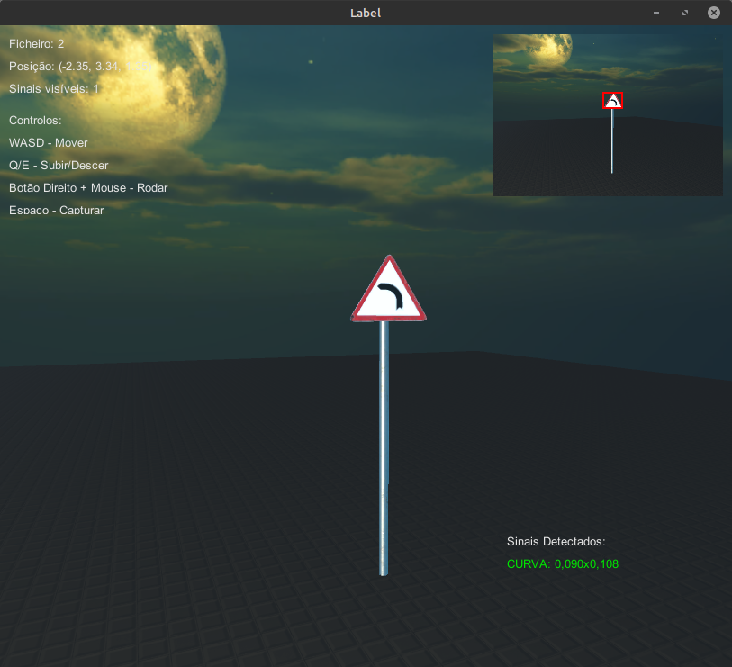

# Traffic Sign Dataset Generator for YOLO

A Unity-based tool designed to generate datasets of specific traffic signs for training YOLO (You Only Look Once) object detection models. This tool automates the process of capturing images and generating corresponding annotations in YOLO format, making it easier to create custom datasets for traffic sign recognition.

## Overview

This project consists of two main components:
- **CameraDatasetGenerator**: A script that handles camera movement, image capture, and annotation generation for traffic signs in a Unity scene. It supports rendering images with bounding boxes and saving them along with YOLO-compatible annotation files.
- **ChildObjectSwitcher**: A utility script to switch between different child objects (e.g., traffic signs) in the scene, allowing for focused visualization and camera positioning on specific signs.

The tool is ideal for developers and researchers working on computer vision projects related to traffic sign detection, providing a customizable and efficient way to build datasets.

## Features

- **Customizable Camera Settings**: Adjust camera resolution, movement speed, and rotation for optimal image capture.
- **Traffic Sign Detection**: Automatically detects and annotates traffic signs in the scene based on predefined tags (e.g., STOP, SPEED_50, etc.).
- **Bounding Box Visualization**: Preview bounding boxes in real-time with customizable colors and validation thresholds.
- **YOLO Annotation Format**: Saves annotations in the YOLO format (normalized bounding box coordinates) for direct use in model training.
- **Interactive Controls**: Move the camera with WASD keys, rotate with mouse input, and capture images with a single keypress or mouse click.
- **Dataset Organization**: Automatically organizes captured images and annotations into separate folders for easy access.

## Requirements

- Unity 3D (version compatible with the provided scripts)
- A scene with 3D models of traffic signs tagged with specific labels (e.g., STOP, PASSAGEM, etc.)
- Basic knowledge of Unity Editor for setup and customization

## Setup

1. Clone or download this repository to your local machine.
2. Open the project in Unity Editor.
3. Attach the `CameraDatasetGenerator.cs` script to a GameObject in your scene (e.g., the Main Camera or an empty GameObject).
4. Assign the main camera in the Inspector under the "Camera Settings" section of the script.
5. Configure the list of traffic sign tags in the Inspector to match the tags used in your scene.
6. Set the output folder path, image resolution, and other parameters as needed.
7. Optionally, attach the `ChildObjectSwitcher.cs` script to a parent GameObject containing multiple traffic sign models to switch between them during testing.

## Screenshots

## Usage

### Controls
- **WASD**: Move the camera horizontally and forward/backward.
- **Q/E**: Move the camera up/down.
- **Right Mouse Button + Mouse Movement**: Rotate the camera.
- **Space or Left Mouse Click**: Capture an image and generate annotations (only if valid traffic signs are visible).
- **G**: Toggle the GUI display.
- **B**: Toggle bounding box visualization.
- **I/P**: Switch to the next/previous child object (if using `ChildObjectSwitcher`).
- **O**: Perform a "Look At" animation to focus the camera on the current child object with a random angle.

### Capturing Data
1. Position the camera to frame the desired traffic signs in the scene.
2. Ensure the signs are within the camera's view and meet the validation criteria (minimum and maximum bounding box size).
3. Press `Space` or click the left mouse button to capture an image. The tool will save the image as a PNG file and generate a corresponding TXT file with YOLO annotations.
4. Captured data is saved in the specified output folder under `images` and `labels` subdirectories.

### Output Format
- **Images**: Saved as PNG files (e.g., `0.png`, `1.png`) in the `Dataset/images` folder.
- **Annotations**: Saved as TXT files (e.g., `0.txt`, `1.txt`) in the `Dataset/labels` folder. Each line in a TXT file follows the YOLO format: `class_id x_center y_center width height`.

## Customization

- **Traffic Sign Tags**: Modify the `signalTags` list in the `CameraDatasetGenerator` script to include or exclude specific traffic signs relevant to your project.
- **Bounding Box Validation**: Adjust `minBoundingBoxSize` and `maxBoundingBoxSize` to filter out signs that are too small or too large in the frame.
- **Camera Parameters**: Change `textureWidth`, `textureHeight`, `moveSpeed`, and `rotationSpeed` for different capture scenarios.
- **Preview Settings**: Enable or disable previews and bounding box visualization, and customize the bounding box color and line width.

## Acknowledgments

This tool was developed to streamline the process of dataset creation for traffic sign detection using YOLO. It leverages Unity's rendering capabilities to simulate real-world scenarios for computer vision training.
